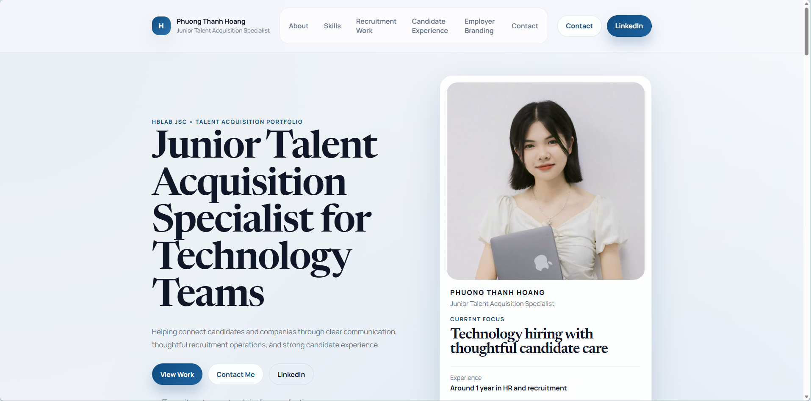

# Phuong Thanh Hoang Portfolio

One-page static portfolio for **Phuong Thanh Hoang**, a **Junior Talent Acquisition Specialist** at **HBLAB JSC**.

The site is built with:

- HTML
- CSS
- Vanilla JavaScript

It is designed for direct deployment on **GitHub Pages** with no build step and no backend.

## Preview

## Project Overview

This portfolio presents an early-career talent acquisition profile with a clean, premium visual style and grounded content for technology recruitment.

Current site highlights:

- Text-only hero section with profile summary card
- Real LinkedIn profile wired into all LinkedIn CTAs
- Employer branding section updated with approved LinkedIn-focused content and a recent post reference
- Mobile-first responsive layout
- Apple-inspired white, soft gray, and deep blue visual system
- Semantic one-page structure for public portfolio use
- Lightweight JavaScript for mobile navigation, section reveal, and active nav states

## Page Sections

The current page includes:

- Header and sticky navigation
- Hero section
- About
- Skills
- Recruitment Work
- Candidate Experience
- Employer Branding
- Contact

## File Structure

- `index.html` - main page markup and content
- `styles.css` - layout, responsive styling, visual system, and animations
- `script.js` - mobile nav toggle, reveal-on-scroll, and section tracking
- `assets/readme-preview.png` - screenshot preview used in this README
- `assets/avatar-placeholder.svg` - fallback placeholder asset kept in the repo

## Local Preview

Open `index.html` directly in a browser.

If you prefer a local server, any simple static server will work.

## Deployment

Deploy directly with GitHub Pages:

1. Push the repository to GitHub.
2. Open `Settings > Pages`.
3. Select the main branch root as the source.
4. Save and wait for publication.

## Current Content State

Already updated in the project:

- Portfolio owner name: `Phuong Thanh Hoang`
- LinkedIn profile URL
- Contact email: `thanhht@hblab.vn`
- Employer branding panel content based on active LinkedIn hiring posts
- Follower reach shown as `11,047 profile followers`

Still placeholder or approval-sensitive:

- Any additional employer branding audience metrics beyond the approved follower count
- Any future wording that would overstate title, company history, or experience level

## Notes

- The site copy is intentionally written to stay credible for around one year of HR and recruitment experience.
- The portfolio should remain aligned with a **Talent Acquisition** profile, not unrelated claims such as Apple or Google product titles.
